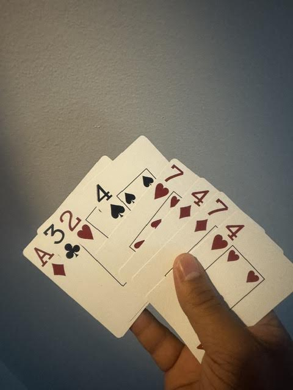
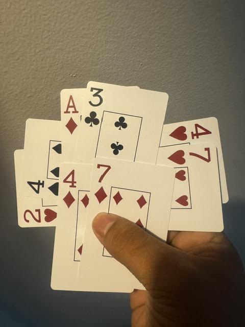
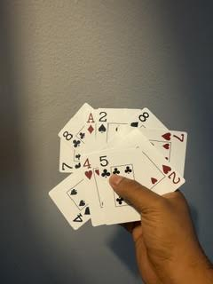

# Even Stevens
A puzzle card game by JT Herndon
## Overview
Even Stevens is a puzzle game designed for passing the time with some heavy thinking. It's like a sudoku puzzle in a deck of cards!
Your main goal will be collecting perfectly even sets out of a hand of 7 cards. You win when you collect almost the whole deck and can predict what the last card is out of what's left.

## Play time
Roughly 5-10 minutes - first couple of learning attempts might be longer, can be kept to 10 minutes if using the solver when stuck after a minute or two

Play time estimates for variants are highly dependent on skill level.

## Setup
Take a standard 52 deck of cards. Remove the 9s through Kings and return them to the box. Aces have a value of 1. Form a draw pile with the remaining 32 cards.
### Solitaire
Draw 7 cards to form a hand.
### Multiplayer
Take 7 cards and put them face-up on the table so they’re all clearly visible if playing with multiple people.

## Object
Collect groups of cards that satisfy the Even Stevens property. Predict the last card before it's drawn.
## Gameplay
This game has no turns. As soon as you see a group of four or six (or eight in challenge mode) that make a valid set among the face-up cards in the middle, discard them. Draw new cards to get the total back up to 7.
#### Multiplayer modes
If you want a friendly cooperative match, you can work together to find sets and discard them as if you were playing a solitaire game. If you want to play competitively, each player collects the cards when they spot an Even Stevens set, and whoever has the most cards at the end wins the game!

Another multiplayer variant (credit to J Simmons): Each player gets a deck. Whoever can play through their deck and correctly identify the last card in their deck without looking at it wins. If an experienced player is playing against a new player or players, the experienced player must use one of the challenge, insanity, or impossible with one deck variants, combined with the "constant card" variant.

## Even Stevens properties
Each number has three properties: it is either even (2,4,6,8) or odd (1,3,5,7), it is either high (5,6,7,8) or low (1,2,3,4), and it is either an outside card (1,2,7,8) or an inside card (3,4,5,6). Suits also have two properties: they can be red or black, and they can be “major suits” (hearts/spades) or “minor suits” (diamonds/clubs).

An Even Stevens set means that for all these number and suit properties, there are an even number of cards for all these properties.

If you collect a set of four, for each property, the four cards either all match, or are split two-and-two.

If you collect a set of six, each property must either all match, or be split two-and-four.

### Examples
`1h, 2h, 3h, 4h` makes a set because 4 are low, 4 are red, 4 are major suits, and it’s a 2-2 split between odd and even, and a 2-2 split between middle and outside cards

`3s, 3c, 6s, 6c` makes a set because 2 are even, 4 are middle, 4 are black, 2 are major suits, and 2 are low

`1h, 4c, 6d, 7s` makes a set because every single subproperty has 2 that are one way and 2 that are the opposite

`3d, 1s, 7h, 2c, 8h, 3h` makes a set because there's 2/4 for high/low, 2/4 for even/odd, 2/4 for outside/inside, 2/4 for black/red, and 2/4 for minor/major,

### Stuck?
Try the solver at [jherndon8.github.io/even-stevens-solver/]((https://jherndon8.github.io/even-stevens-solver/)) or try a play through of Easy/Tutorial mode below.

## Game end
When there is only one card left in the deck, do not draw it. Look at all of the cards and try to deduce what card it should be. If you've collected all valid sets, then the final card when added to the remaining uncollected cards should all form a final set. If your prediction is right, you win! If not, trace back through the sets you collected and try to see where you went wrong. For competitive multiplayer, count who has collected the most cards. That player wins!

## Tips
Instead of 1,2,7,8 as outside and 3,4,5,6 as inside cards, it might be easier to split them by high and low and think of 1,4/5,8 as "outside" and 2,3/6,7 as "inside." Any valid Even Stevens set will satisfy both ways of thinking about it.

An easier way to think about suits is that one of each forms a set, and a pair of the same suit "cancels out". So for a four-card set you'll either have one of each, all the same, or two pairs of suits. Some valid suit-only examples: dddd, hhcc, sscc, ddss, hcsd, hcsdss, ddsscc, hhhcsd

For finding a set of size 6 or greater, there must be one pair among the numbers. These numbers "cancel out" and the remaining four should form a set among the number properties. Same goes for the suits. In the final example above, the 3s pair up while a 1,2,7,8 makes a set numberwise, and the hearts pair up while the others form a set suit-wise.

## "Constant Card" Variant
For a slightly longer game, choose one card from your initial hand to be the permanent card. Whenever you find an Even Stevens set which includes the permanent card, discard all cards EXCEPT the permanent card. About half your sets will include the permanent card by chance so you should need a few more sets than a normal game to get through the whole deck.

For the game end of this variant, if there's an even number of uncollected cards (including the last in the deck) then the permanent card should be used in the final set. If there's an odd number, then ignore the permanent card for deducing the final card.

## Easy/Tutorial mode
#### Est. play time: 3-5 minutes
If you find yourself struggling on your first run, try starting with only 16 cards, drawing 6 instead of 7. You can either use ace through four of all suits, or you can use ace through 8 but only the red cards. Try each and see which one you struggle with more, and do a couple play-throughs of that one to make the normal game easier.

## Challenge mode
#### Est. play time: 20-40 minutes, 10-20 minutes with one deck
Find a second deck that has a distinguishable front from the original deck (I find gift shop cards work better than standard cards for this). Now being in one deck vs. the other becomes another property to keep track of, and you have twice as many cards to get through. For this challenge mode, you will need to draw 8 cards instead of 7. Even Stevens sets of size 8 are allowed. For added fun, put one card in a card box without looking at it. When you get to the end, you have to predict which card AND which deck it came from.

## Insanity mode
#### Est. play time: A few hours, 30-60 minutes with one deck
For the truly insane willing to kill a few hours, find a third and fourth deck, each deck with distinguishable card faces. Assign a "Deck suit" of heart, club, spade, and diamond, one to each deck. Now your Even Stevens set need an even number of cards from Red Decks, Black Decks, Major Decks, and Minor Decks, while satisfying all other normal Even Stevens rules. Draw up to 9 cards instead of 7 for this mode. The same setup for the ending in challenge mode applies.

## Impossible mode
#### Est. play time: Hours or days - 45-90 minutes with one deck.

If you have all the time in the world to kill, get 8 decks, forming a 256-card gauntlet. Assign each deck a number 1-8. Draw 10 cards instead of 7. The card values as well as their deck numbers need to form a set.

NOTE: for the previous three modes it didn't matter if the assignment was changed mid-game since swapping suits around wouldn't change the validity between different sets in different hand. For impossible mode, the mapping of deck to number MUST stay consistent. I recommend grabbing a 9 from each deck and putting them somewhere else on the table in a row just as a reference for the order.

## Challenge / Insanity / Impossible modes with 1 deck
To preview these modes without getting another deck, use the multiplayer setup of laying the cards on the table. Then, lay each card either vertically or horizontally for challenge mode, alternating between what card gets drawn, or vertically, horizontally, or diagonally, cycling through the 4 options for insanity mode. The different orientations represent coming from different decks.

For impossible mode, form 8 piles on the table and cycle through which pile gets added. Each pile is from a different "deck"

In-hand setups are possible, see images below.

